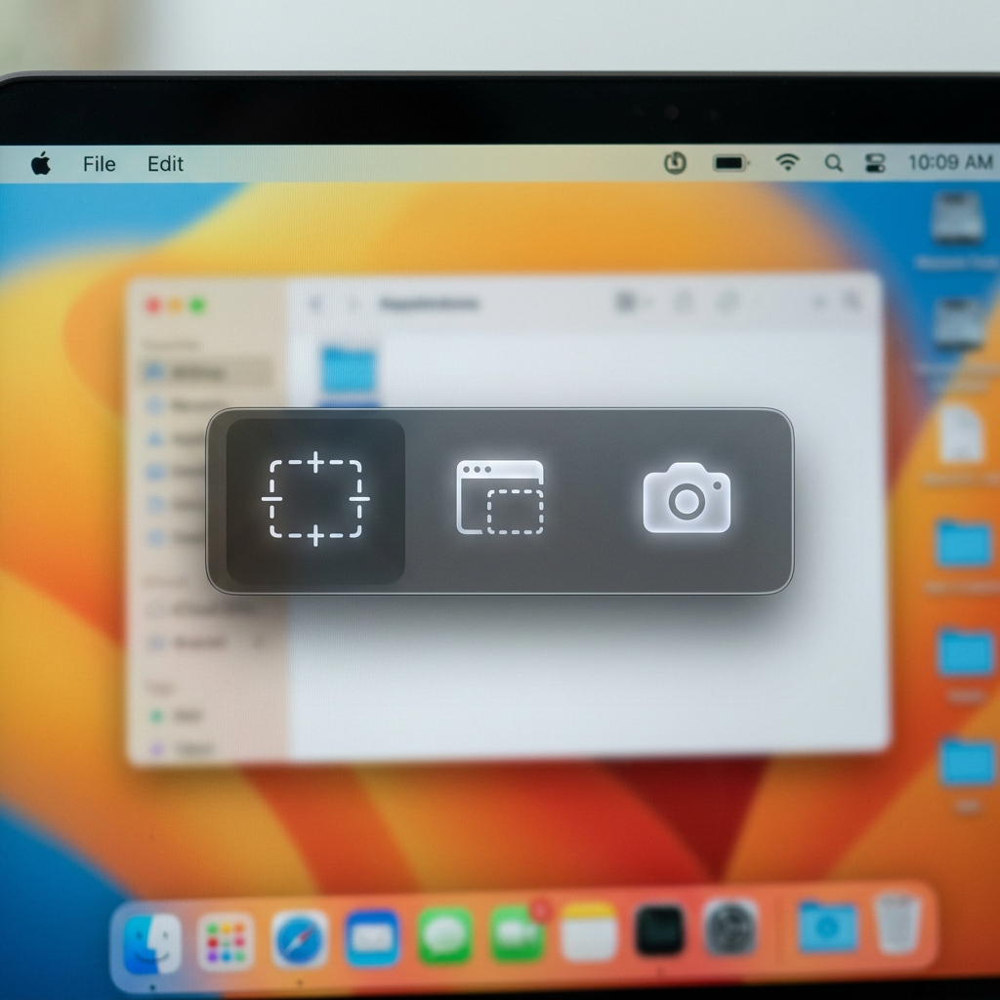

# SnipFlow

A lightweight, native macOS screenshot utility inspired by the Windows 11 Snipping Tool. Built in Swift and SwiftUI with zero external dependencies.



SnipFlow lets you capture screen regions with a global shortcut, perform offline OCR text recognition, pin screenshots as floating reference stickers, and automatically save captured files to your Pictures directory.

---

## Features
* **Windows-Style Selection Bar**: Press `Option + Shift + S` (configurable) to show an overlay bar at the top-center of the screen with **Rectangular**, **Window**, and **Fullscreen** capture options.
* **Native Crop & Selection**: Integrates seamlessly with macOS's built-in crop and camera capture interfaces.
* **Local Offline OCR**: Extracts text from any screenshot instantly using Apple's native **Vision Framework** (entirely offline, free, fast, and secure).
* **Floating Stickers (Snip & Pin)**: Keep screenshots floating on top of your work. Supports dragging, aspect-ratio-locked resizing, and transparency adjustments.
* **Auto-Save**: Automatically saves every capture as a timestamped PNG file inside the **`Pictures > Screenshots`** (`~/Pictures/Screenshots/`) directory.
* **No API Keys Needed**: Unlike transcription tools, SnipFlow runs 100% locally on your machine with no external web services.

---

## Installation & Build

SnipFlow is compiled natively from source using standard macOS Command Line Tools.

### Prerequisites
* macOS 14.0 (Sonoma) or newer.
* Xcode Command Line Tools installed (run `xcode-select --install` in Terminal if missing).

### Building SnipFlow
1. Open Terminal in the `snipflow` directory.
2. Run the build script:
   ```bash
   ./build.sh
   ```
3. Open the generated **`SnipFlow.app`** application bundle.

---

## Configuration & Permissions
1. Press `Option + Shift + S` to start your first capture.
2. macOS will prompt you to grant **Screen Recording** permissions.
3. Open System Settings and enable the switch next to **SnipFlow** under **Privacy & Security -> Screen & System Audio Recording**.

---

## License

This project is open-source. Feel free to use, modify, and distribute it.
